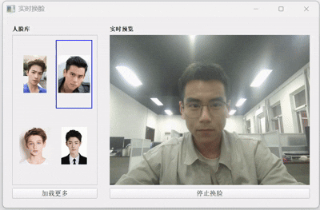

# 实时换脸应用

基于InsightFace的实时人脸交换应用，支持CPU和GPU加速。

## 功能特点

- 实时摄像头人脸检测和交换
- 支持多个人脸库管理
- 支持自定义人脸导入
- 支持高/低分辨率模式切换
- GPU加速支持（如果可用）
- 实时FPS显示
- 简洁美观的图形界面

## 效果展示




## 系统要求

- Python 3.7+
- CUDA支持（可选，用于GPU加速）
- 摄像头设备

## 依赖安装

```bash
pip install -r requirements.txt
```

## 项目结构

```
.
├── README.md
├── requirements.txt
├── swapper_gui.py          # CPU版本
├── swapper_gui_gpu.py      # GPU版本
├── models/                 # 模型文件夹
    ├── inswapper_128.onnx  # 换脸模型
    └── buffalo_l
            1k3d68.onnx
            2d106det.onnx
            det_10g.onnx
            genderage.onnx
            w600k_r50.onnx
└── faces/                  # 人脸库文件夹
    └── *.jpg              # 人脸图片
```

## 模型链接

百度网盘: https://pan.baidu.com/s/1Sikabb9xhDWN2yc1QZC1YQ?pwd=srzk 提取码: srzk

## 使用方法

1. 运行应用：
   ```bash
   # CPU版本
   python swapper_gui.py
   
   # GPU版本（如果支持CUDA）
   python swapper_gui_gpu.py
   ```

2. 界面操作：
   - 左侧面板显示人脸库
   - 点击"加载更多"可以添加新的人脸
   - 点击人脸库中的人脸选择要交换的目标人脸
   - 点击"开始换脸"启动实时换脸
   - 使用"高分辨率模式"按钮切换检测精度

3. 人脸库管理：
   - 将人脸图片放入`faces`文件夹
   - 支持jpg、png、jpeg格式
   - 每张图片应包含一个清晰的人脸

## 注意事项

- 确保摄像头正常工作
- 保持适当的光照条件
- 人脸应正对摄像头
- GPU版本需要CUDA支持
- 首次运行时会自动下载模型文件

## 性能优化

- 低分辨率模式：更快的处理速度，适合性能较低的设备
- 高分辨率模式：更好的检测效果，需要更强的计算能力
- GPU加速：显著提升处理速度（如果可用）

## 常见问题

1. 无法打开摄像头
   - 检查摄像头连接
   - 确保没有其他程序占用摄像头
   - 尝试重启应用

2. 未检测到人脸
   - 调整光照条件
   - 确保人脸正对摄像头
   - 尝试切换到高分辨率模式

3. 性能问题
   - 使用低分辨率模式
   - 关闭其他占用资源的程序
   - 考虑使用GPU版本

## 许可证

MIT License

## 致谢

- [InsightFace](https://github.com/deepinsight/insightface)
- [OpenCV](https://opencv.org/)
- [PyQt5](https://www.riverbankcomputing.com/software/pyqt/)
